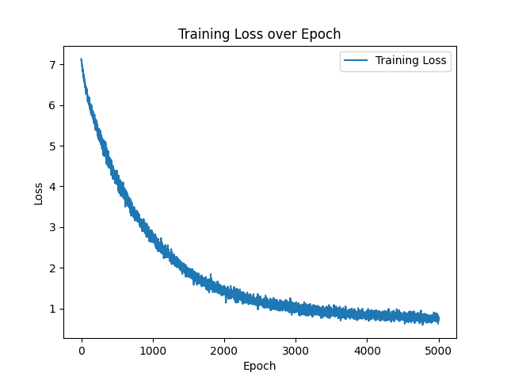

# numoGPT

A minimal PyTorch re-implementation of OpenAI GPT (Generative Pretrained Transformer) training [GPT](https://github.com/openai/gpt-2), both training and inference. numoGPT tries to be small, clean, interpretable and educational, as most of the currently available GPT model implementations can a bit sprawling. 
GPT is not a complicated model and this implementation is appropriately about 300 lines of code (see [numogpt/model.py](numogpt/model.py)). All that's going on is that a sequence of indices feeds into a [Transformer](https://arxiv.org/abs/1706.03762), and a probability distribution over the next index in the sequence comes out. 
The majority of the complexity is just being clever with batching (both across examples and over sequence length) for efficiency.

* **numoGPT** is alternative fork from [minGPT](https://github.com/karpathy/minGPT)


## Updates:
* [Demo](demo.py) has been implemented, that demonstrated training on input [train text](data/train-nn.txt).
* Embedded openai' GPT2: [tokens volabulary](gpt-2/vocab.bpe), [json-vocabulary](gpt-2/encoder.json) of indices for encoder.
* Implemented filtering by stopwords: ([stopwords.txt](data/stopwords.txt)).
* Implemented **TextDataset** ([text_dataset.py](numogpt/text_dataset.py)) with splitting the input text into token-blocks.


## Model:
Working demo: [demo.py](demo.py)

* device:  **cpu**
* model:   **gpt-numo**
* n_layer: **4**
* n_head:  **4**
* n_embd:  **64**
* block:   **8**
* params:  **3.42M**
* stop_w:  **TRUE**


### tokens_block size=8:
```
tokens-word distribution: {5: 191, 7: 256, 4: 88, 3: 29, 6: 306, 2: 1, 1: 1}
TextDataset.sz=873, block_size=8, epoch_size=110
number of parameters: 3.42M
running on device: cpu
...on 100th iter...
...on 200th iter...
...on 300th iter...
...on 400th iter...
...on 500th iter...
...
...on 1600th iter...
...on 1700th iter...
...on 1800th iter...
...on 1900th iter...
...on 2000th iter...
...finished 2000 iter(s)
--------------------------------------------------------------------------------
evaluate_gpt epoch:: batches=28, batch_sz=32
val_loss=0.9435, perplexity(PPL)=2.5691
```



### Text generation by specified prompt:
```
--------------------------------------------------------------------------------
prompt ("text"): clustering models proposed consider
--------------------------------------------------------------------------------
```


### References:

* **1.** [minGPT](https://github.com/karpathy/minGPT) from Andrej Karpathy
* **2**  [minbpe](https://github.com/karpathy/minbpe) from Andrej Karpathy
* **3.** [Karpathy-nn-zero-to-hero-gpt-exercises](https://www.kaggle.com/code/chizkidd/karpathy-nn-zero-to-hero-gpt-exercises/notebook)
* **4.** [Training a Mini-GPT to Learn Two-Digit Addition](https://www.gaohongnan.com/influential/generative_pretrained_transformer/05_adder.html)
